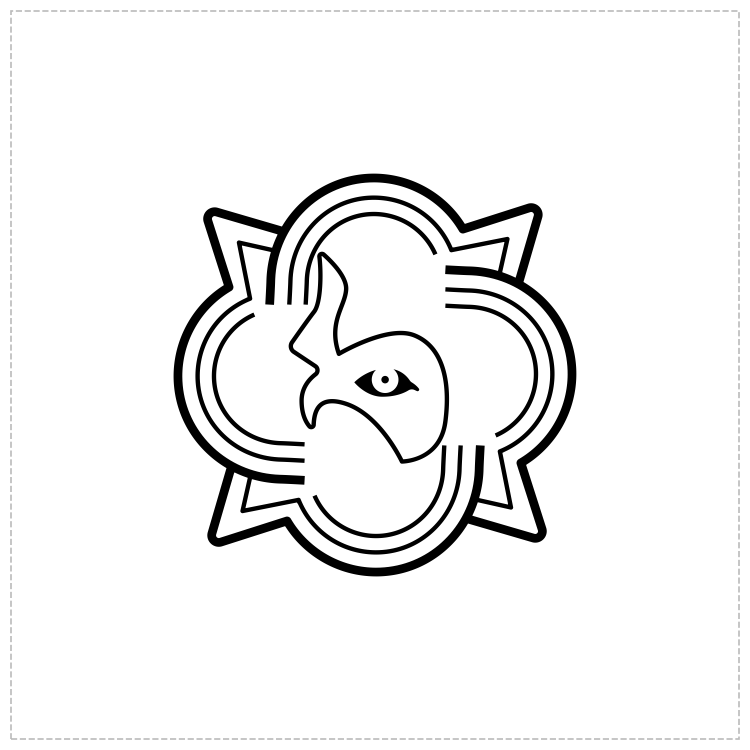

# Oberndörfer crest — DXF

Vector DXF of the crest, converted from the Canva PDF at true physical size.



## Files

| File | Geometry | Origin |
| --- | --- | --- |
| `oberndorfer-crest-splines.dxf` | Exact Bézier curves as `SPLINE` entities | Artboard lower-left |
| `oberndorfer-crest-polylines.dxf` | Flattened `LWPOLYLINE`, 0.005 mm chord tolerance | Artboard lower-left |
| `oberndorfer-crest-splines-trimmed.dxf` | Exact, as above | Artwork lower-left |
| `oberndorfer-crest-polylines-trimmed.dxf` | Flattened, as above | Artwork lower-left |
| `preview.png` | Render of the spline DXF, dashed line = artboard | — |
| `source-logo.pdf` | The PDF this was converted from | — |

**Which one to use.** Take `-splines.dxf` if your software handles splines — it is
the artwork exactly. Take `-polylines.dxf` for laser cutters, plotters and CAM
that would rather have polylines; at 0.005 mm it is well below anything those
machines can resolve. The `-trimmed` pair is the same geometry with the origin
moved to the artwork itself, for when the artboard margin is in the way.

## Dimensions

| | |
| --- | --- |
| Artboard | 132.2917 × 132.2917 mm (13.229 × 13.229 cm) |
| Artwork | 73.1990 × 73.2029 mm |
| Artwork position | (29.5448, 29.5440) mm from the artboard's lower-left corner |
| Contours | 10 closed contours, 739 Bézier control points |

All files: DXF R2000, units millimetres (`$INSUNITS` = 4, `$MEASUREMENT` = 1),
single layer `LOGO`, entities `BYLAYER` at ACI colour 7.

Colour 7 is the CAD convention for "black on a light background, white on a
dark one". A viewer with a dark model space will therefore draw the crest
white — that is the viewer, not the file.

## How it was converted

Reproduce with:

```sh
python3 scripts/pdf_to_dxf.py source-logo.pdf . --name oberndorfer-crest
```

The source PDF holds real vector data, so nothing was traced — the curves are
carried across unchanged. Getting at them took some care, though. Canva paints
each shape by **clipping a filled rectangle to the outline**, so the real
geometry lives in the clipping paths, and the fill operators are just
rectangles. Asking a PDF library for the page's drawings returns nine
rectangles and none of the artwork. `scripts/pdf_to_dxf.py` therefore walks the
content streams directly — graphics state, nested Form XObjects, the full path
operator set — and collects the clip paths in device space.

Each closed subpath becomes a single cubic B-spline. A chain of cubic Béziers
is exactly representable as a cubic B-spline with triple knots at the joins, so
this is a change of representation, not an approximation; straight segments are
carried as Béziers with collinear control points, which is likewise exact.

## Verification

| Check | Result |
| --- | --- |
| Extracted geometry vs. a 600 dpi render of the source PDF | IoU 0.999994 (3 pixels of 529,786, antialiasing) |
| Spline control points vs. source Béziers | identical to 0.000000 nanometres |
| Polyline chord deviation from the true curve | 3.736 µm (tolerance 5 µm) |
| `ezdxf` audit, both files | 0 errors, 0 fixes |

The spline check is the meaningful one, and it is sampling-free: all 739
control points and the knot vectors are compared directly against the source
curves, so it measures the file rather than a rendering of it.
