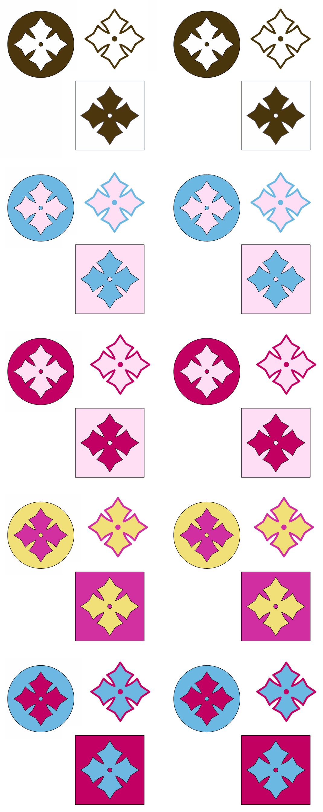
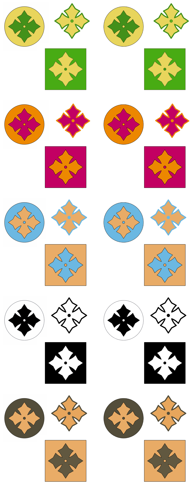

# Motif tiles — vectorised

The ten colourways, vectorised from the 2048 × 2048 px PNGs.




| Colourway | Files | Palette |
| --- | --- | --- |
| Brown | `motif-brown.svg` / `.pdf` | `#4b360d` on white, `#4e5769` rule |
| Blue / pink | `motif-blue-pink.svg` / `.pdf` | `#6cb8e2`, `#fedff4`, black outline |
| Magenta / pink | `motif-magenta-pink.svg` / `.pdf` | `#c20063`, `#fedff4`, black outline |
| Pink / yellow | `motif-pink-yellow.svg` / `.pdf` | `#d22fa1`, `#f1e078`, black outline |
| Magenta / blue | `motif-magenta-blue.svg` / `.pdf` | `#c20063`, `#6cb8e2`, black outline |
| Green / yellow | `motif-green-yellow.svg` / `.pdf` | `#48ab14`, `#e9d55c`, `#438f1a`, `#69b720` dot |
| Orange / magenta | `motif-orange-magenta.svg` / `.pdf` | `#ed8800`, `#c20063`, black outline |
| Blue / tan | `motif-blue-tan.svg` / `.pdf` | `#6cb8e2`, `#e9ac67`, black outline |
| Black / white | `motif-black-white.svg` / `.pdf` | `#000000` on white, `#404249` rule |
| Olive / tan | `motif-olive-tan.svg` / `.pdf` | `#534d3a`, `#e9ac67`, `#615840` |

SVGs carry `viewBox="0 0 2048 2048"` so they scale to anything; the PDFs are
512 × 512 pt. Backgrounds are transparent — the paper is not painted. Each file
is ~86–100 KB, about 1,800–2,450 curve and line segments.

Reproduce with:

```sh
python3 scripts/vectorize_flat_art.py source-brown.png . --name motif-brown
```

## How they were traced

The sources are flat colour with anti-aliased edges. The obvious approach —
trace each colour separately — leaves hairline gaps wherever two regions share
an edge, because the two traces never agree exactly. So regions are painted as
nested shapes instead:

1. Quantise to the image's own palette, merging entries within a small RGB
   distance so 254-white and 255-white do not become separate layers. A colour
   qualifies on being **solid**, not on being common — see below.
2. Take connected regions per colour and **fill their holes**, so each region is
   simply connected with exactly one outline.
3. Paint them **largest first**. A hole in a region is by construction covered
   by regions nested inside it, which are smaller and so painted later.

Nothing can gap, because whatever sits on top is drawn over a parent that
already extends underneath it. Thin drawn outlines fall out of the same rule:
an outline's filled extent is the whole enclosed shape, painted first, with the
fill painted over the middle leaving the outline showing.

Outlines are fitted with the corner-preserving line/curve fitter in
`scripts/vectorize_lineart.py`, so the straight edges of the cross stay straight,
the circle stays a smooth curve, and the spike tips stay sharp.

## Picking the palette

Frequency is the wrong test for what counts as a colour. A small deliberate
detail — the lighter green dot at the centre of the green/yellow cross, about
1,100 px — is *rarer* than the anti-aliasing fringe along a long edge, so any
frequency threshold that rejects the fringe also rejects the dot. The first run
did exactly that and the dot silently took its neighbour's green.

So a colour qualifies by being solid: erode its mask and see whether anything
survives. A fringe is a pixel or two wide and vanishes; a real region, however
small, does not. That recovered the dot and left everything else unchanged.

## Verification

Each PDF was rasterised back to 2048 px and compared against its source:

| | pixels differing by >32/255 | of those, **off** any edge |
| --- | --- | --- |
| Brown | 0.417% | 0 |
| Blue / pink | 0.415% | 0 |
| Magenta / pink | 0.453% | 0 |
| Pink / yellow | 0.423% | 0 |
| Magenta / blue | 0.440% | 0 |
| Green / yellow | 0.462% | 0 |
| Orange / magenta | 0.497% | 1 px |
| Blue / tan | 0.400% | 0 |
| Black / white | 0.355% | 12 px |
| Olive / tan | 0.387% | 0 |

Essentially every disagreeing pixel lies on a region boundary — the differences
are anti-aliasing along edges, not shape error. Eight of the ten have **no**
off-edge pixel at all; the other two are down to a dozen isolated pixels at
sharp corners. That is the result you want: the shapes are right and only the
one-pixel edge blend differs, as it must when replacing pixels with curves.

The three compositions are not identical to each other, so each was traced
separately rather than recoloured from one master: the brown and blue/pink
layouts match (edge IoU 0.975) as do magenta/pink and magenta/blue (0.992), but
pink/yellow differs from both, and the two groups differ from each other
(~0.68).
