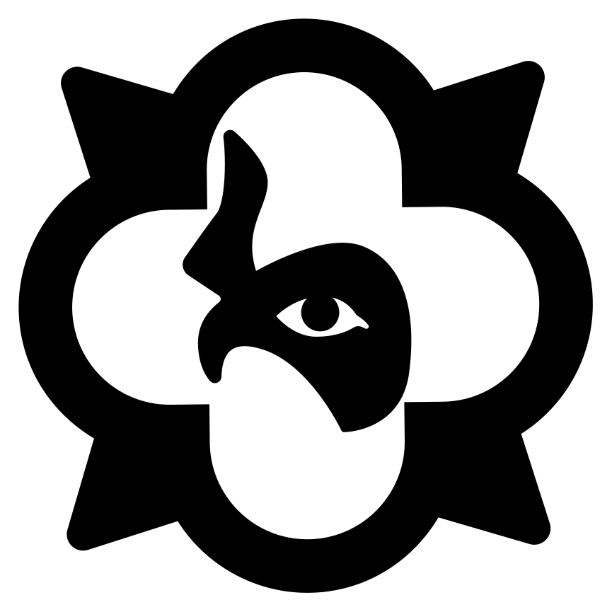

# TraxNYC crest — solid form

The crest rebuilt as a solid emblem: one continuous wide band around the
outside, no hairlines.



| File | What it is |
| --- | --- |
| `traxnyc-crest-solid.pdf` | The solid crest |
| `reference-stylized.pdf` | The stylized TraxNYC logo the proportions come from |
| `source-outlined.pdf` | The Illustrator original this was built from |

Both are 392.856 × 392.856 pt, 81 curve/line segments, ~5 KB, pure black fill.

Reproduce with:

```sh
python3 scripts/solidify_crest.py source-outlined.pdf out.pdf --lane 34.401 --arm 62.608
```

## What was wrong

The source is line art, not a solid shape. Measured around the perimeter:

| Element | In the source |
| --- | --- |
| Outer rim | continuous, uniform 8.0 pt (99.2% of 1,381 samples within 7.5–8.5 pt) |
| Inner lane | **four separate arcs**, each ~364 pt long and ~4 pt wide, each thickening to ~8.4 pt at one end |

So the outer rim was never the problem. The lane inside it is four hairline
arcs with abrupt 8 pt stubs at their ends — as a solid shape that reads as a
thin, broken ring rather than the wide continuous band on the real piece.

## How the solid form is built

Not by editing the traced outline — by rebuilding the frame from primitives.

**Symmetry.** The silhouette has exact 4-fold *rotational* symmetry and is
**not** mirror symmetric: mirroring mismatches by 2.70% of area, while a 90°
rotation mismatches by 0.00%. It is a pinwheel, the lobe centres sitting 0.6343°
off the cardinal axes. Mirroring it would corrupt the design, so only C4 is
enforced — by averaging the three structurally identical quadrants (they agree
to **0.003 pt**) and replicating one 90° sector.

**Circles.** The four lobes are true circles, r = **97.5226 pt**, centres
**86.9174 pt** from the crest centre, the four independent fits agreeing to
**0.0013 pt**. The band's inner edge is therefore emitted as exact circular arcs
(4/3·tan(θ/4) Béziers), not a traced approximation — they sit within **0.0033 pt**
of the true circles.

The band is the silhouette with a quatrefoil hole, so it is one continuous band
of uniform width the whole way round, star points included.

## The inner shape is a rounded cross

The inner shape is **not** a quatrefoil of overlapping circles. In the stylized
logo the arms have straight parallel sides meeting at sharp concave corners on
the diagonals — that is two crossing capsules (a rounded cross), and no union
of circles produces that corner. Two earlier builds got this wrong by fitting
circles and then arguing about how deep to cut the notch between them; the
shape family itself was wrong.

Proportions are taken from `reference-stylized.pdf` rather than guessed. Its
band is four pinwheel quadrant pieces whose union leaves the cross as a hole;
fitting a rounded cross to that hole gives a residual of **0.62%** of area
(the rest is the source's own drawing tolerance), confirming the construction:

| | in the stylized logo | as a ratio | on this 368.856 pt crest |
| --- | --- | --- | --- |
| Arm half-width | 37.721 pt | 0.169737 | **62.608 pt** (125.2 pt arms) |
| Cross tip radius | 90.389 pt | 0.406735 | **150.027 pt** |
| Band at the cardinals | 20.726 pt | 0.093265 | **34.401 pt** |

The cross is emitted exactly: 8 straight segments and 4 semicircular caps, so
the corners are true right angles at r = a·√2 and the caps are true arcs.

## Verification

| Check | Result |
| --- | --- |
| Frame C4 symmetry, output geometry | 0.00004% area mismatch under 90° rotation |
| Band width at the four cardinals | 34.398 pt at all four |
| Cross corner radius | 88.541 pt = a·√2 exactly |
| Emitted cross vs. ideal capsule union | 0.011% of area |
| Symmetrised silhouette vs. source | 0.00037% of area |
| Emitted arcs vs. true circles | max 0.0033 pt |
| Consolidated script vs. verified build | IoU 0.999997 at 432 dpi |
