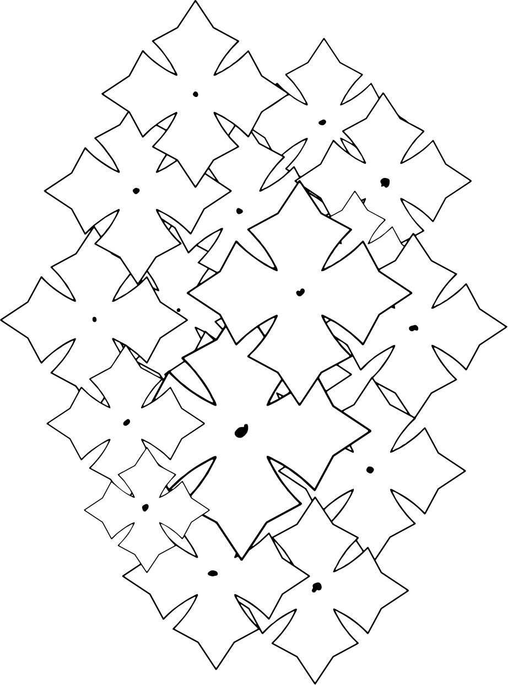

# T-shirt back print — folded cross

Vector version of the folded-cross back print, traced from the raster original.



## Files

| File | Page / canvas | Use |
| --- | --- | --- |
| `tshirt-back-folded-cross.svg` | 909.82 × 1320 pt | Web, digital layout — keeps the original page position |
| `tshirt-back-folded-cross.pdf` | 909.82 × 1320 pt | Print, keeps the original page position |
| `tshirt-back-folded-cross.eps` | 909.82 × 1320 pt | Screen print / older RIPs |
| `tshirt-back-folded-cross-trimmed.svg` | 442.18 × 596.38 pt | Artwork cropped to its own bounds — place and scale on the garment |
| `tshirt-back-folded-cross-trimmed.pdf` | 442.18 × 596.38 pt | Same, for print |
| `tshirt-back-folded-cross-trimmed.eps` | 442.18 × 596.38 pt | Same, for screen print |
| `preview.png` | 922 × 1243 px | Raster preview of the trimmed artwork only |
| `source-raster.pdf` | 909.82 × 1320 pt | The raster original this was traced from |

Artwork size in the trimmed files is 156.0 × 210.4 mm (6.14 × 8.28 in). It is
vector, so scale it to whatever the print calls for.

All vector files are pure black fills (`#000000`) on a transparent background,
no strokes, even-odd fill rule. 80 contours, 2,288 segments — 1,148 straight
lines and 1,140 curves.

## How it was traced

`source-raster.pdf` is a wrapper around a single 1668 × 2420 px JPEG (132 dpi,
greyscale line art, ~3 px strokes, one connected outline network plus 14 solid
dots). It holds no vector data, so the outlines were traced rather than
extracted.

Reproduce with:

```sh
python3 scripts/vectorize_lineart.py source-raster.pdf . --name tshirt-back-folded-cross
```

### Why not just potrace

The first attempt used potrace at maximum fidelity, and that was the wrong
target. On a 132 dpi JPEG the pixel staircase and compression ringing along a
3 px stroke are noise, but a general-purpose tracer cannot tell them from
signal — it fitted them faithfully, and every edge that should have been dead
straight came out with a visible ripple. It scored 0.971 soft IoU against the
source precisely *because* it reproduced the noise.

`scripts/vectorize_lineart.py` targets the drawing instead of the pixels:

1. Sub-pixel iso-contours from the greyscale, so the starting point is the
   anti-aliased edge rather than the pixel grid.
2. Break each contour into straight runs, then place each vertex at the
   intersection of its neighbours' least-squares lines — long edges come out
   as single straight segments, and corners stay sharp instead of being
   rounded off by the simplification.
3. Refit the runs that turn gently and consistently in one direction as smooth
   Béziers. The design is mostly straight, but the tapered spike shapes are
   genuinely curved, and polygonising everything left them visibly faceted.
4. Drop contours under 1 px² — sub-pixel specks, invisible at any print size.

The result is 2,288 segments against potrace's 13,086, with straight edges
actually straight.

### On the fidelity numbers

| | Soft IoU vs. source | Ink weight | Segments |
| --- | --- | --- | --- |
| potrace, max fidelity | 0.971 | 1.0022 | 13,086 |
| this tracer | 0.936 | 0.9994 | 2,288 |

The lower IoU is the point, not a regression: the gap is the digitisation noise
this tracer declines to reproduce. Ink weight 0.9994 shows nothing was thinned
or fattened in the process — stroke weight matches the original to within 0.1%.

Parameters were chosen by sweeping and inspecting the result at 16× zoom.
`--line-tol` (default 0.5 source px) is the knob that matters: it sets how much
deviation counts as noise rather than shape. Below ~0.4 some ripple survives;
above ~0.8 genuine curves start being flattened into chords.
